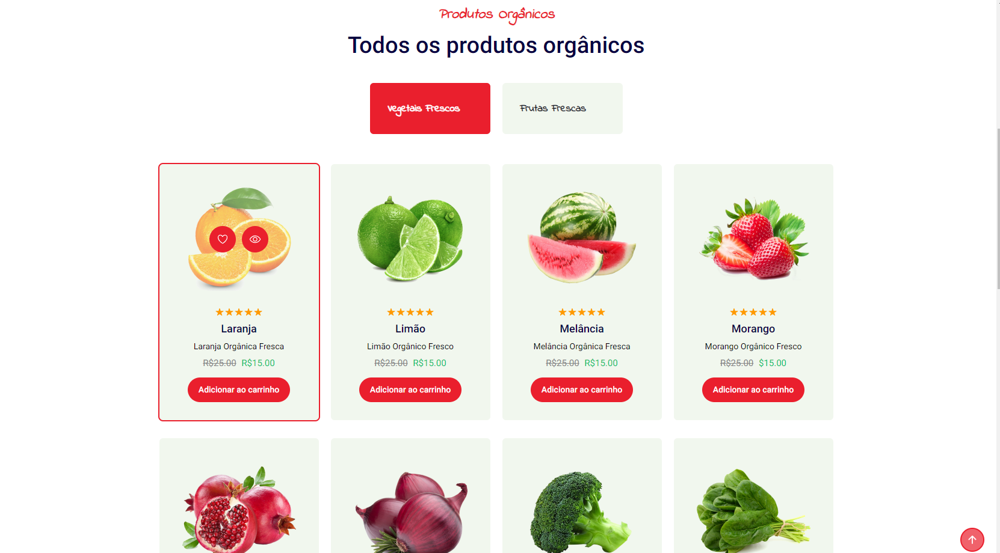

# Projeto Vem Ser Tech - Ada/iFood - Projeto final do módulo estático

- [Deployment](https://herbertcaiosama.github.io/projeto-front-end-estatico/)

## Desenvolvimento de uma proposta de site para o Ifood.

Neste projeto final, você ou seu grupo, como participantes da turma #VemSerTech, que é uma parceria entre o iFood e a Ada, terão a oportunidade de aplicar todo o conhecimento adquirido em HTML e CSS para desenvolver uma proposta inovadora de website para o iFood, uma das principais plataformas de entrega de comida online. Sua missão é apresentar uma visão criativa e aprimorada para a renovação do iFood por meio deste projeto de website.

### Requisitos:

1. **Título e Descrição:** A página inicial do website deve conter um título atraente que represente a nova visão do iFood e uma breve descrição que explique os recursos e benefícios da plataforma renovada.
2. **Header:** O site deve incluir um cabeçalho (header) que contenha o logotipo ou nome do iFood (pode propor novo logotipo) e uma seção de navegação para diferentes seções do site. 
3. **Home:** A parte inicial da pagina, pode ter apenas a logo e alguma mensagem, exemplo: “O jeito mais fácil de pedir delivery de comida e fazer mercado. Leia avaliações de restaurantes, faça seu pedido pela internet e receba em casa.”
4. **Cardápio/Catálogo Digital:** A parte central do site deve apresentar o novo catálogo digital, destacando os recursos e funcionalidades inovadoras da plataforma. Cada prato deve ser apresentado em um "card" com as seguintes informações:

  - Uma imagem do prato.
  - Nome do prato.
  - Uma breve descrição do prato.

5. Tabela de restaurantes: A tabela deve conter os seguintes dados:

  a. Nome
  b. Nota
  c. Breve descrição

6. Formulário de Contato: Crie um formulário de contato que permita aos visitantes enviar perguntas, sugestões e feedback sobre a nova plataforma, todos os dados devem ser obrigatórios. O formulário deve incluir campos:

  a. Nome.
  b. E-mail.
  c. Mensagem.

**HTML/JavaScript**

```HTML
<!-- Adicione o onsubit no elemento form -->
<form onsubmit="onSubmit()">

<!-- Adicione esse script na pagina -->
<script>
  function onSubmit () {
    alert('Feedback enviado com sucesso!')
  }
</script>
```

7. **Footer:** O rodapé (footer) deve conter informações de contato, como e-mail e telefone de suporte.
8. **Responsividade:** Certifique-se de que o site seja responsivo, adaptando-se a diferentes dispositivos, como smartphones e computadores.
9. **Otimização para SEO:** Utilize boas práticas de SEO para garantir que a proposta de site para o iFood seja bem indexada pelos motores de busca.

## Notas Importantes:

- Responsividade pode ser testada apenas em smartphone e computadores, não é necessário tablet.
- Embora este seja um projeto fictício, leve em consideração a importância de apresentar uma proposta profissional e inovadora para a renovação da plataforma iFood.
- Você pode usar imagens e informações fictícias para ilustrar sua proposta.
- É permitido o uso do Bootstrap.

## Entrega:

- A proposta final deve ser entregue através do Github
- Cada membro do grupo deve enviar o link do github no LMS

Esta atividade deve ser entregue no LMS. Na área de Projetos você enviará o link do seu github com o projeto. 

## Image Hero


## Image Product



## Image Table - Form


## Image Footer

